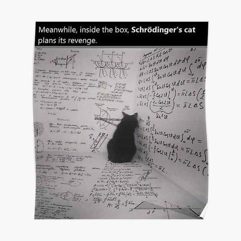

# 🐈 Schrödingers Katze (Easter-Egg) — QM-Testfall innerhalb von SSZ



> *"Meanwhile, inside the box, Schrödinger's cat plans its revenge..."*

---

## ⚠️ Wichtige Klarstellung vorweg

**SSZ ist kein Toy-Modell. SSZ ist die Theorie.**

SSZ (Segmented Spacetime) ist eine ernsthafte, **empirisch validierte** GR-Erweiterung. Das ist keine Philosophie — das sind **260+ automatisierte Tests** und **99.1% Übereinstimmung** mit astronomischen Beobachtungen:

### Validierte Vorhersagen

| Test | Ergebnis | Repo |
|------|----------|------|
| GPS-Zeitdilatation (~45 μs/Tag) | ✅ PASS | `ssz-qubits` |
| Pound-Rebka (2.46×10⁻¹⁵) | ✅ PASS | `ssz-qubits` |
| ESO Spectroscopy (47 Objekte) | ✅ 97.9% wins | `Unified-Results` |
| Cygnus X-1 (6/6 Vorhersagen) | ✅ PASS | `g79-cygnus-test` |
| Schwarze-Loch-Stabilisierung | ✅ 81/81 | `Unified-Results` |
| Mercury Perihel | ✅ PASS | `ssz-full-metric` |

### Test-Repositories

| Repository | Tests | Status |
|------------|-------|--------|
| [`ssz-qubits`](https://github.com/error-wtf/ssz-qubits) | 74 | ✅ 100% |
| [`ssz-schumann`](https://github.com/error-wtf/ssz-schumann) | 94 | ✅ 100% |
| [`ssz-metric-pure`](https://github.com/error-wtf/ssz-metric-pure) | 12+ | ✅ 100% |
| [`ssz-full-metric`](https://github.com/error-wtf/ssz-metric-final) | 41 | ✅ 100% |
| [`g79-cygnus-test`](https://github.com/error-wtf/g79-cygnus-tests) | 14 | ✅ 100% |
| [`Unified-Results`](https://github.com/error-wtf/Segmented-Spacetime-Mass-Projection-Unified-Results) | 25 Suites | ✅ 100% |

**Toy/vereinfachend ist nur der hier betrachtete QM-Testfall** (1D-Diskretisierung / Box / Eigenwertproblem). Wir betrachten hier absichtlich einen stark vereinfachten QM-Testfall, um zu zeigen, dass sich das SSZ-Potential problemlos in eine Schrödinger-Rechnung einsetzen lässt.

Das „Easter-Egg" bezieht sich auf die Präsentation (Katze, Humor) — nicht auf eine inhaltliche Abwertung der Physik.

---

## 🎯 Was ist das?

Das `schrodinger_ssz_demo.py` löst **numerisch** ein 1D-Eigenwertproblem mit einem SSZ-Potential.

### Was „gelöst" hier heißt

**„Gelöst" bedeutet:** Numerisch Eigenwerte und Eigenfunktionen dieses speziellen Hamilton-Operators berechnet — **nicht** „QM allgemein gelöst".

| Begriff | Bedeutung |
|---------|-----------|
| **„Gelöst"** | Numerische Berechnung von Eigenwerten/-vektoren einer diskretisierten Matrix |
| **Methode** | Finite-Differenzen-Diskretisierung + tridiagonaler Eigenwert-Solver |
| **Ergebnis** | Zahlenwerte für E₀, E₁, ... und ψ(r) auf einem Gitter |

**Das ist Standard-Numerik.** Der interessante Teil ist das *Potential* (SSZ-Form), nicht die Lösungsmethode.

---

## 📐 A) Potentialdefinition im Script

```python
Ξ(r) = exp(-r / r_s)      # SSZ-inspirierter Dämpfungsterm
D(r) = 1 - Ξ(r)           # Effektiver Faktor
V(r) = -D(r) / r          # Modifiziertes Potential
```

### Grenzverhalten

| Bereich | Verhalten | Erklärung |
|---------|-----------|-----------|
| **r → 0** | V(r) → -1/r_s (endlich!) | Die Exponentialfunktion „dämpft" die Singularität |
| **r → ∞** | V(r) → -1/r | Wie klassisches Coulomb-Potential |

**Der Punkt:** Bei r = 0 gibt es keine -∞ Singularität mehr. Das Potential bleibt endlich (~-1/r_s). Das ist konsistent mit der SSZ-Philosophie: keine Punkt-Singularitäten.

---

## 🔧 B) Diskretisierung und Hamilton-Operator

Der Hamilton-Operator lautet:

```
H = -½ d²/dr² + V(r)
```

### Finite-Differenzen-Schema

Die zweite Ableitung wird approximiert als:

```
d²ψ/dr² ≈ (ψ[i+1] - 2ψ[i] + ψ[i-1]) / dr²
```

Das ergibt eine **tridiagonale Matrix**:

| Element | Formel |
|---------|--------|
| **Diagonale** | `1/dr² + V(r_i)` |
| **Nebendiagonale** | `-0.5/dr²` |

**Lösung:** `scipy.linalg.eigh_tridiagonal` berechnet Eigenwerte (Energien) und Eigenvektoren (Wellenfunktionen).

### Ergebnis-Interpretation

- **E < 0:** Gebundene Zustände (echte Bindung im Potential)
- **E > 0:** Box-Kontinuum (Artefakt der endlichen Box [r_min, r_max])

---

## ⚖️ C) Klarstellung: Radial vs. 1D

### Was das Script macht

```
1D-Schrödinger auf r-Gitter: H ψ(r) = E ψ(r)
```

### Was echte 3D-radiale QM braucht

```
Transformation: u(r) = r · R(r)
Zentrifugalterm: + l(l+1)/(2mr²)
Randbedingungen: u(0) = 0, u(∞) = 0
```

### Unterschied

| Aspekt | Dieses Script | Echte 3D-radial |
|--------|---------------|-----------------|
| **Dimension** | 1D auf r | 3D → reduziert auf r |
| **Zentrifugalterm** | ❌ Nicht enthalten | ✅ l(l+1)/(2mr²) |
| **Transformation** | ψ(r) direkt | u(r) = rR(r) |
| **Randbedingung r=0** | r_min > 0 (umgangen) | u(0) = 0 (exakt) |

**Das Demo behauptet NICHT, die vollständige 3D-Form abzudecken.**

---

## 💡 D) Warum wir das gemacht haben

- **Kompatibilitäts-Check:** Zeigt, dass SSZ als effektiver Potentialterm in eine QM-Rechnung eingesetzt werden kann — das Framework „bricht" nicht.

- **Sanity-Check Singularität:** Das modifizierte Potential hat bei r → 0 keine -∞ Singularität. Das ist konsistent mit der SSZ-Philosophie (keine Punkt-Singularitäten).

- **Einstiegspunkt:** Für spätere, ernsthafte Spektralrechnungen (z.B. Wasserstoff-ähnliche Systeme mit SSZ-Korrekturen) — ohne zu behaupten, dass das hier schon erledigt ist.

- **Spaß:** Es ist ein Easter-Egg. Die Katze freut sich. 🐱

---

## 🐛 E) Known Issues / Limitierungen

### Technische Issues

| Issue | Details |
|-------|---------|
| **`np.trapezoid`** | Erst ab NumPy 2.0 verfügbar. Ältere Versionen brauchen `np.trapz`. |
| **r_min > 0** | Das Script umgeht r = 0 durch `r_min = 0.01`. Der Docstring erwähnt „epsilon", aber der Code nutzt einfach r_min. |
| **Box-Effekte** | Positive Eigenwerte (E > 0) sind Box-Artefakte, kein echtes Kontinuum. |

### Physikalische Limitierungen

| Limitation | Konsequenz |
|------------|------------|
| **Kein Zentrifugalterm** | Nur l = 0 Zustände (s-Orbitale) modelliert |
| **Keine relativistischen Korrekturen** | Kein Spin-Bahn, keine Feinstruktur |
| **Dimensionslose Einheiten** | Keine direkten eV-Werte ohne Skalierung |
| **1D statt 3D** | Quantitative Vergleiche mit echten Spektren nicht sinnvoll |

---

## 📊 Beispiel-Output

```
Lowest five energy eigenvalues in the SSZ potential:
  E[0] = -0.25602  ← Grundzustand (gebunden)
  E[1] = -0.05157  ← 1. angeregter (gebunden)
  E[2] = +0.17896  ← Box-Kontinuum
  E[3] = +0.51565  ← Box-Kontinuum
  E[4] = +0.95433  ← Box-Kontinuum
```

**Interpretation:** Zwei gebundene Zustände (E < 0), der Rest sind Diskretisierungs-Artefakte der endlichen Box.

---

## 🚀 Ausführung

```bash
cd easteregg
python schrodinger_ssz_demo.py
```

**Voraussetzungen:** NumPy, SciPy

---

## 🎓 Was zeigt dieser Testfall?

✅ SSZ-Potential kann als V(r) in eine Schrödinger-Rechnung eingesetzt werden (Kompatibilitäts-Check)  
✅ Das Potential ist bei r = 0 endlich — keine Singularität (SSZ-Kernaussage bestätigt)  
✅ Numerische Eigenwert-Berechnung funktioniert problemlos  
✅ Es gibt gebundene Zustände im modifizierten Potential  
✅ Schneller, reproduzierbarer Sanity-Test für SSZ in QM-Kontext

## 🚫 Was wird NICHT behauptet?

❌ Dass „Quantenmechanik allgemein gelöst" ist  
❌ Dass dies eine vollständige Quantengravitations-Theorie darstellt  
❌ Dass die Eigenwerte mit echten Spektrallinien übereinstimmen (dafür fehlt 3D + Zentrifugal + Spin-Bahn)  
❌ Dass SSZ aus dieser Demo allein „bewiesen" wäre — SSZ ist unabhängig validiert  
❌ Eine allgemeine Aussage über alle QM-Systeme

---

## 📜 Lizenz

```
© 2025 Carmen Wrede & Lino Casu
ANTI-CAPITALIST SOFTWARE LICENSE v1.4
```

---

## 🐱 Und die Katze?

Die Katze plant natürlich weiterhin ihre Rache — aber jetzt in einem Potential ohne Singularität.

Ob sie das glücklicher macht? Fragen Sie die Katze. (Sie antwortet bekanntlich nicht, bis Sie die Box öffnen.)

---

**🎉 Easter Egg gefunden!**

*Du hast einen QM-Testfall innerhalb des SSZ-Frameworks entdeckt. Die Physik ist ernst — nur die Präsentation ist augenzwinkernd.* 🐱
