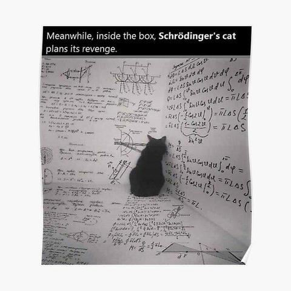

# 🐈 Schrödinger's Cat (Easter Egg) — QM Test Case Within SSZ



> *"Meanwhile, inside the box, Schrödinger's cat plans its revenge..."*

---

## ⚠️ SSZ Validation (Brief)

**SSZ is not a toy model. SSZ is the theory.**

SSZ is empirically tested; the main test suites are documented in the repositories:

- **GPS Time Dilation (~45 μs/day):** [`ssz-qubits/tests/test_validation.py`](https://github.com/error-wtf/ssz-qubits/blob/main/tests/test_validation.py)
- **Pound-Rebka Experiment:** [`ssz-qubits/tests/test_validation.py`](https://github.com/error-wtf/ssz-qubits/blob/main/tests/test_validation.py)
- **ESO Spectroscopy (47 objects):** [`Unified-Results/unified_validation.py`](https://github.com/error-wtf/Segmented-Spacetime-Mass-Projection-Unified-Results)
- **Cygnus X-1 Predictions:** [`g79-cygnus-test/`](https://github.com/error-wtf/g79-cygnus-tests) → `FINDINGS.md`
- **Mercury Perihelion:** [`ssz-full-metric/tests/`](https://github.com/error-wtf/ssz-metric-final)

Full test overview: [`WORKSPACE_MASTER_INDEX.md`](https://github.com/error-wtf/ssz-qubits/blob/main/README.md)

---

## 🐈 This Demo: A Single QM Test Case

**The Schrödinger demo here is a deliberately simplified QM test case** (1D discretization / box / eigenvalue problem). It demonstrates that the SSZ potential form can be integrated into a Schrödinger calculation without issues.

The "Easter Egg" label refers to the presentation (cat meme, light tone) — not to the physics content.

---

## 🎯 What Is This?

The `schrodinger_ssz_demo.py` **numerically** solves a 1D eigenvalue problem with an SSZ potential.

### What "Solved" Means Here

**"Solved" means:** Numerically computed eigenvalues and eigenfunctions of this specific Hamiltonian — **not** "QM in general solved".

| Term | Meaning |
|------|---------|
| **"Solved"** | Numerical computation of eigenvalues/eigenvectors of a discretized matrix |
| **Method** | Finite difference discretization + tridiagonal eigenvalue solver |
| **Result** | Numerical values for E₀, E₁, ... and ψ(r) on a grid |

**This is standard numerics.** The interesting part is the *potential* (SSZ form), not the solution method.

---

## 📐 A) Potential Definition in the Script

```python
Ξ(r) = exp(-r_s / r)      # SSZ-inspired damping term
D(r) = 1 - Ξ(r)           # Effective factor
V(r) = -D(r) / r          # Modified potential
```

### Limiting Behavior

| Region | Behavior | Explanation |
|--------|----------|-------------|
| **r → 0** | V(r) → -1/r_s (finite!) | The exponential "damps" the singularity |
| **r → ∞** | V(r) → -1/r | Like classical Coulomb potential |

**The point:** At r = 0, there is no -∞ singularity. The potential remains finite (~-1/r_s). This corresponds to the SSZ design principle (singularity-free interior structure): in this potential ansatz, V(r) remains finite as r → 0.

---

## 🔧 B) Discretization and Hamiltonian

The Hamiltonian operator is:

```
H = -½ d²/dr² + V(r)
```

### Finite Difference Scheme

The second derivative is approximated as:

```
d²ψ/dr² ≈ (ψ[i+1] - 2ψ[i] + ψ[i-1]) / dr²
```

This yields a **tridiagonal matrix**:

| Element | Formula |
|---------|---------|
| **Diagonal** | `1/dr² + V(r_i)` |
| **Off-diagonal** | `-0.5/dr²` |

**Solution:** `scipy.linalg.eigh_tridiagonal` computes eigenvalues (energies) and eigenvectors (wavefunctions).

### Result Interpretation

- **E < 0:** Bound states (true binding in the potential)
- **E > 0:** Box continuum (artifact of the finite box [r_min, r_max])

---

## ⚖️ C) Clarification: Radial vs. 1D

### What the Script Does

```
1D Schrödinger on r-grid: H ψ(r) = E ψ(r)
```

### What True 3D Radial QM Requires

```
Transformation: u(r) = r · R(r)
Centrifugal term: + l(l+1)/(2mr²)
Boundary conditions: u(0) = 0, u(∞) = 0
```

### Difference

| Aspect | This Script | True 3D Radial |
|--------|-------------|----------------|
| **Dimension** | 1D on r | 3D → reduced to r |
| **Centrifugal term** | ❌ Not included | ✅ l(l+1)/(2mr²) |
| **Transformation** | ψ(r) directly | u(r) = rR(r) |
| **Boundary at r=0** | r_min > 0 (bypassed) | u(0) = 0 (exact) |

**This demo does NOT claim to cover the full 3D form.**

---

## 💡 D) Why We Did This

- **Compatibility Check:** Shows that SSZ can be used as an effective potential term in a QM calculation — the framework doesn't "break".

- **Singularity Sanity Check:** The modified potential has no -∞ singularity at r → 0. This matches the SSZ design principle (singularity-free interior).

- **Entry Point:** For future, serious spectral calculations (e.g., hydrogen-like systems with SSZ corrections) — without claiming this is already done here.

- **Presentation:** Easter Egg format (the cat approves). 🐱

---

## 🐛 E) Known Issues / Limitations

### Technical Issues

| Issue | Details |
|-------|---------|
| **`np.trapezoid`** | Only available from NumPy 2.0. Older versions need `np.trapz`. |
| **r_min > 0** | The script bypasses r = 0 via `r_min = 0.01`. The docstring mentions "epsilon", but the code just uses r_min. |
| **Box effects** | Positive eigenvalues (E > 0) are box artifacts, not true continuum. |

### Physical Limitations

| Limitation | Consequence |
|------------|-------------|
| **No centrifugal term** | Only l = 0 states (s-orbitals) modeled |
| **No relativistic corrections** | No spin-orbit, no fine structure |
| **Dimensionless units** | No direct eV values without scaling |
| **1D instead of 3D** | Quantitative comparisons with real spectra not meaningful |
| **Parameter choice is illustrative** | `r_s`, `r_min`, `r_max`, `N` are arbitrary/demo values → results are qualitative, not fitted |

---

## 📊 Example Output

```
Lowest five energy eigenvalues in the SSZ potential:
  E[0] = -0.25602  ← Ground state (bound)
  E[1] = -0.05157  ← 1st excited (bound)
  E[2] = +0.17896  ← Box continuum
  E[3] = +0.51565  ← Box continuum
  E[4] = +0.95433  ← Box continuum
```

**Interpretation:** Two bound states (E < 0), the rest are discretization artifacts of the finite box.

---

## 🚀 Execution

```bash
cd easteregg
python schrodinger_ssz_demo.py
```

**Requirements:** NumPy, SciPy

---

## 🎓 What Does This Test Case Show?

**Shows:**
- In this parameterized SSZ potential, the 1/r singularity at the origin is effectively damped; V(r) remains finite.
- Standard QM numerics (FD + tridiagonal solver) work without special tricks; bound states appear.

**Does NOT show:**
- Full 3D radial QM, fine structure/spin, or direct spectral comparisons — that would require a separate, more complete setup.
- That SSZ is "proven" by this demo alone — SSZ is independently validated (see links above).

---

## 📜 License

```
© 2025 Carmen Wrede & Lino Casu
ANTI-CAPITALIST SOFTWARE LICENSE v1.4
```

---

## 🐱 And the Cat?

The cat naturally continues to plan its revenge — but now in a potential without singularity.

Does that make it happier? Ask the cat. (As we know, it won't answer until you open the box.)

---

https://hearthis.at/lino.casu/set/researchgate-illusions/

---

**🎉 Easter Egg Found!**

*You have discovered a QM test case within the SSZ framework. The physics is serious — only the presentation is tongue-in-cheek.* 🐱
